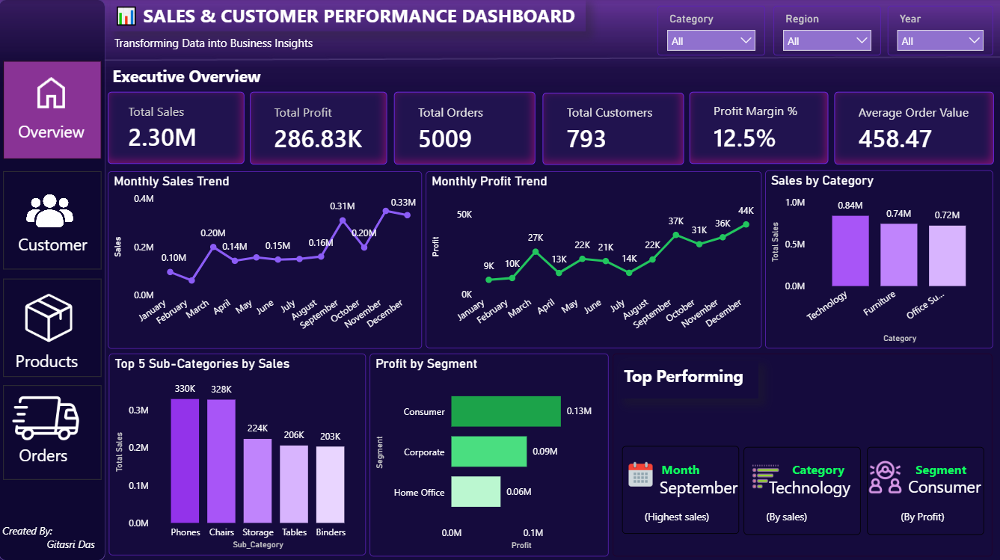
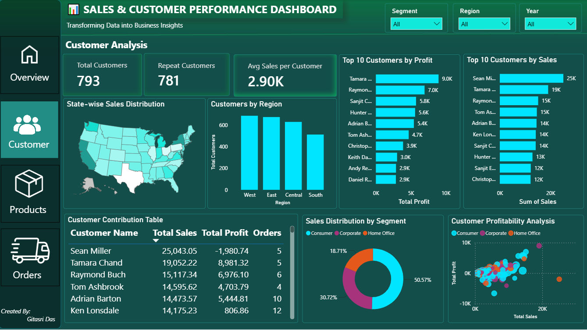
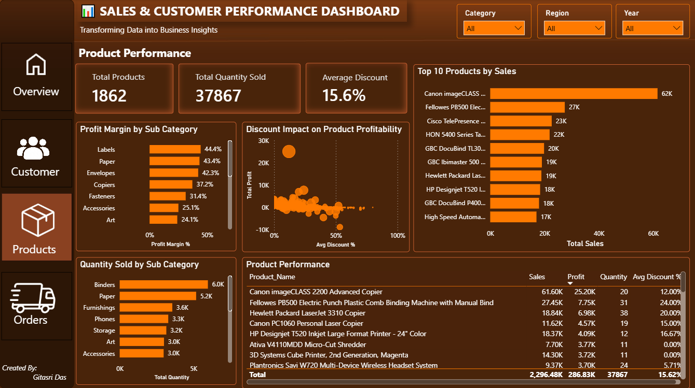

# 📊 Sales & Customer Performance Analysis Dashboard

## 📌 Project Overview

This project is an interactive **Sales & Customer Performance Analysis Dashboard** built using **SQL and Power BI**.  
The dashboard analyzes sales performance, customer behavior, product profitability, and order trends to help businesses make data-driven decisions.

The goal of this project is to transform raw sales data into meaningful insights through data cleaning, data modeling, DAX calculations, and interactive visualizations.

---

## 🛠 Tools & Technologies Used

- SQL Server (Data Cleaning & Transformation)
- Power BI (Dashboard Development & Visualization)
- DAX (Measures & Calculations)
- Power Query (Data Preparation)
- Data Modeling

---
## 📂 Dataset Information

The dataset contains e-commerce sales transactions including:

- Orders
- Customers
- Products
- Categories
- Regions
- Sales
- Profit
- Discount
- Shipping Details

---

## 🔄 Project Workflow

### 1. Data Import & Cleaning (SQL Server)

- Imported CSV dataset into SQL Server
- Checked missing values
- Removed null records
- Verified data consistency
- Created SQL views for analysis

---

### 2. SQL Analysis Performed

✔ Total Sales Analysis  
✔ Profit Analysis  
✔ Customer Analysis  
✔ Product Performance Analysis  
✔ Regional Sales Analysis  
✔ Monthly Sales Trends  
✔ Discount Impact Analysis  
✔ Shipping Performance Analysis  

---

## 📊 Dashboard Pages

### 1️⃣ Executive Overview

Provides a high-level business summary.

**Key Insights:**
- Total Sales Performance
- Total Profit Analysis
- Total Orders
- Total Customers
- Average Order Value
- Profit Margin %
- Monthly Sales Trend
- Monthly Profit Trend
- Sales by Category
- Top Performing Month, Category & Segment

---

### 2️⃣ Customer Analysis Dashboard

Analyzes customer behavior and customer contribution.

**Key Insights:**
- Total Customers
- Repeat Customers
- Average Sales per Customer
- State-wise Sales Distribution
- Customers by Region
- Top Customers by Sales
- Top Customers by Profit
- Sales Distribution by Segment
- Customer Profitability Analysis

---

### 3️⃣ Product Performance Dashboard

Focuses on product-level performance and profitability.

**Key Insights:**
- Total Products
- Total Quantity Sold
- Average Discount
- Top 10 Products by Sales
- Profit Margin by Sub-Category
- Discount Impact on Product Profitability
- Quantity Sold by Sub-Category
- Product Performance Details

---

### 4️⃣ Order Analysis Dashboard

Analyzes order patterns and shipping performance.

**Key Insights:**
- Total Orders
- Average Order Value
- Average Discount
- Average Delivery Days
- Monthly Order Trend
- Orders by Region
- Orders by Ship Mode
- Sales by Ship Mode
- Top Shipping Method Analysis

---

## 📊 Key Business Insights

✔ Technology category generated the highest sales  
✔ Consumer segment contributed the highest profit  
✔ September recorded the highest sales performance  
✔ Standard Class was the most preferred shipping method  
✔ Discount impact analysis helps identify profitability patterns  

---

---
## 📊 Dashboard Preview

### 🏠 Executive Overview

### 👥 Customer Analysis

### 📦 Product Performance Analysis

### 🛒 Order Analysis

## 🚀 Skills Demonstrated

- Data Cleaning
- SQL Queries
- Data Transformation
- Data Modeling
- DAX Measures
- KPI Creation
- Business Intelligence Reporting
- Dashboard Design
- Data Visualization

---

## 🎯 Conclusion

This dashboard provides a complete view of sales performance, customer behavior, product insights, and order operations.

It enables data-driven decision-making by identifying growth opportunities and performance gaps.

---

## 👩‍💻 Created By

**Gitasri Das**  

